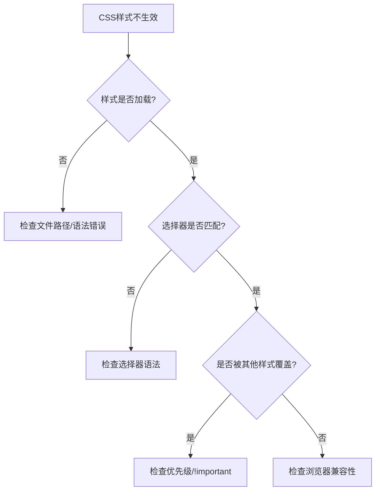

# CSS样式不生效问题排查

CSS 样式不生效是前端开发中非常常见的问题，核心原因可以归纳为 **"样式未被正确应用" 或 "被其他样式覆盖"**。本文将从排查逻辑、常见原因到解决方案进行系统梳理。

## 1. 问题分析框架

### 排查思路



### 核心原因分类

1. **样式未被正确解析或加载**
2. **选择器问题：未精准匹配目标元素**
3. **样式优先级被覆盖**
4. **浏览器渲染或兼容性问题**

## 2. 样式未被正确解析或加载

### 2.1 语法错误

CSS 语法严格，任何小错误都会导致样式失效：

```css
/* ❌ 错误示例 */
.box {
    color: red    /* 缺少分号 */
    backgroud: blue;  /* 拼写错误 */
    width: 100;   /* 缺少单位 */
} /* 如果这里缺少闭合括号，后续样式都会失效 */

/* ✅ 正确示例 */
.box {
    color: red;
    background: blue;
    width: 100px;
}
```

**常见语法错误：**
- 遗漏闭合符号（`}`、`;`）
- 属性或值拼写错误
- 非零值省略单位
- 注释格式错误（使用 `//` 而非 `/* */`）

### 2.2 样式文件未加载

```html
<!-- ❌ 常见加载问题 -->
<link rel="stylesheet" href="./style.css">  <!-- 路径错误 -->
<link rel="stylesheet" href="/css/style.css" type="text/css">  <!-- MIME类型非必需 -->

<!-- ✅ 正确加载 -->
<link rel="stylesheet" href="./css/style.css">
<link rel="stylesheet" href="https://cdn.example.com/style.css">
```

**排查方法：**
```javascript
// 检查样式表是否加载成功
document.styleSheets.length; // 查看加载的样式表数量
Array.from(document.styleSheets).forEach((sheet, index) => {
    console.log(`样式表 ${index}:`, sheet.href);
});
```

### 2.3 缓存问题

```javascript
// 强制刷新清除缓存的方法
// 1. 浏览器快捷键：Ctrl+Shift+R (Windows) / Cmd+Shift+R (Mac)
// 2. 添加版本参数
const link = document.createElement('link');
link.rel = 'stylesheet';
link.href = `./style.css?v=${Date.now()}`;
document.head.appendChild(link);
```

## 3. 选择器问题

### 3.1 选择器未匹配目标元素

```html
<!-- HTML结构 -->
<div class="container">
    <div class="wrapper">
        <div class="box item">内容</div>
    </div>
</div>
```

```css
/* ❌ 错误的选择器 */
.container .item {  /* 直接后代选择器，但中间有wrapper */
    color: red;
}

.box.item {  /* 类名之间不能有空格 */
    color: blue;
}

/* ✅ 正确的选择器 */
.container .wrapper .item {  /* 完整路径 */
    color: red;
}

.container .item {  /* 后代选择器（推荐） */
    color: red;
}

.box.item {  /* 同时具有两个类名 */
    color: blue;
}
```

### 3.2 伪类和伪元素错误

```css
/* ❌ 常见错误 */
.button:hove {  /* 拼写错误 */
    background: blue;
}

.box:before {  /* 应该使用双冒号 */
    content: "";
}

/* ✅ 正确写法 */
.button:hover {
    background: blue;
}

.box::before {
    content: "";
    display: block;  /* 伪元素需要设置display */
}
```

## 4. 样式优先级问题

### 4.1 CSS优先级规则

```css
/* 优先级从高到低 */
/* 1. 内联样式 (1000) */
<div style="color: red;">

/* 2. ID选择器 (100) */
#header { color: blue; }

/* 3. 类选择器、属性选择器、伪类 (10) */
.nav { color: green; }
[type="text"] { color: yellow; }
:hover { color: purple; }

/* 4. 元素选择器、伪元素 (1) */
div { color: black; }
::before { color: gray; }
```

### 4.2 优先级计算实例

```css
/* 优先级计算 */
div.box#container .item {
    /* ID(100) + 类(10) + 元素(1) + 类(10) = 121 */
    color: red;
}

#container .box .item {
    /* ID(100) + 类(10) + 类(10) = 120 */
    color: blue;  /* 优先级较低，不会生效 */
}

.box .item {
    /* 类(10) + 类(10) = 20 */
    color: green !important;  /* !important 强制生效 */
}
```

### 4.3 解决优先级冲突

```css
/* 方法1: 提高选择器优先级 */
.container .nav .item.active {
    color: red;
}

/* 方法2: 使用 !important (不推荐滥用) */
.item {
    color: red !important;
}

/* 方法3: 重置样式 */
.item {
    color: unset;  /* 重置为初始值 */
    color: inherit; /* 继承父元素 */
    color: initial; /* 使用初始值 */
}
```

## 5. 浏览器兼容性问题

### 5.1 CSS属性兼容性

```css
/* Flexbox 兼容性写法 */
.container {
    display: -webkit-box;      /* 旧版 WebKit */
    display: -webkit-flex;     /* WebKit */
    display: -ms-flexbox;      /* IE 10 */
    display: flex;             /* 标准语法 */
}

/* Grid 兼容性 */
.grid-container {
    display: -ms-grid;         /* IE 10-11 */
    display: grid;             /* 现代浏览器 */
}

/* CSS变量兼容性 */
.element {
    background: #ff0000;       /* 回退值 */
    background: var(--primary-color, #ff0000);
}
```

### 5.2 前缀自动化工具

```javascript
// 使用 Autoprefixer
const autoprefixer = require('autoprefixer');
const postcss = require('postcss');

postcss([autoprefixer])
    .process(css, { from: undefined })
    .then(result => {
        console.log(result.css);
    });
```

## 6. 元素特性限制

### 6.1 替换元素问题

```css
/* 图片尺寸问题 */
img {
    width: 100px;
    height: 100px;  /* 可能被图片原始比例影响 */
    object-fit: cover;  /* 解决比例问题 */
}

/* 表单元素样式 */
input[type="text"] {
    -webkit-appearance: none;  /* 移除默认样式 */
    appearance: none;
    border: 1px solid #ccc;
    padding: 8px;
}
```

### 6.2 显示状态影响

```css
/* 隐藏元素的样式问题 */
.hidden-element {
    display: none;  /* 完全不渲染，样式不生效 */
}

.invisible-element {
    visibility: hidden;  /* 占位但不可见，样式生效 */
    opacity: 0;         /* 透明但存在，样式生效 */
}
```

## 7. 动态样式问题

### 7.1 CSS变量作用域

```css
:root {
    --primary-color: #007bff;
    --font-size: 16px;
}

.component {
    --local-color: #28a745;  /* 局部变量 */
    color: var(--primary-color);  /* 全局变量 */
    background: var(--local-color);
}

/* ❌ 变量未定义 */
.error {
    color: var(--undefined-color);  /* 会使用默认值或继承 */
}

/* ✅ 提供回退值 */
.safe {
    color: var(--undefined-color, #000);  /* 黑色作为回退 */
}
```

### 7.2 动态生成元素的样式

```javascript
// 问题：动态添加的元素样式可能不生效
function addElement() {
    const div = document.createElement('div');
    div.className = 'dynamic-element';
    document.body.appendChild(div);
    
    // ❌ 立即设置样式可能不生效
    div.style.opacity = '1';
    
    // ✅ 使用 requestAnimationFrame 确保渲染
    requestAnimationFrame(() => {
        div.style.opacity = '1';
        div.style.transform = 'translateY(0)';
    });
}

// 或者使用 CSS 过渡
// CSS:
// .dynamic-element {
//     opacity: 0;
//     transform: translateY(-20px);
//     transition: all 0.3s ease;
// }
// .dynamic-element.show {
//     opacity: 1;
//     transform: translateY(0);
// }

function addElementWithTransition() {
    const div = document.createElement('div');
    div.className = 'dynamic-element';
    document.body.appendChild(div);
    
    // 触发重排后添加类名
    div.offsetHeight; // 强制重排
    div.classList.add('show');
}
```

## 8. 排查工具和技巧

### 8.1 浏览器开发者工具

```javascript
// 1. 检查元素样式
// 右键 → 检查元素 → Styles 面板

// 2. 查看计算后的样式
// Computed 面板显示最终生效的样式

// 3. 检查样式表加载
console.log('加载的样式表数量:', document.styleSheets.length);
Array.from(document.styleSheets).forEach(sheet => {
    console.log('样式表:', sheet.href || '内联样式');
});

// 4. 检查CSS规则
function checkCSSRules(selector) {
    Array.from(document.styleSheets).forEach(sheet => {
        try {
            Array.from(sheet.cssRules || sheet.rules).forEach(rule => {
                if (rule.selectorText && rule.selectorText.includes(selector)) {
                    console.log('找到规则:', rule.cssText);
                }
            });
        } catch (e) {
            console.log('无法访问样式表:', sheet.href);
        }
    });
}
```

### 8.2 CSS调试技巧

```css
/* 1. 边框调试法 */
* {
    border: 1px solid red !important;  /* 查看所有元素边界 */
}

/* 2. 背景色调试 */
.debug {
    background: rgba(255, 0, 0, 0.1) !important;
}

/* 3. 轮廓调试（不影响布局） */
.debug-outline {
    outline: 2px solid red !important;
}
```

### 8.3 CSS验证工具

```javascript
// CSS语法验证
function validateCSS(cssText) {
    try {
        const style = document.createElement('style');
        style.textContent = cssText;
        document.head.appendChild(style);
        
        // 检查是否有语法错误
        const sheet = style.sheet;
        console.log('CSS规则数量:', sheet.cssRules.length);
        
        document.head.removeChild(style);
        return true;
    } catch (error) {
        console.error('CSS语法错误:', error);
        return false;
    }
}

// 使用示例
validateCSS(`
    .test {
        color: red;
        background: blue;
    }
`);
```

## 9. 常见问题 FAQ

### Q1: 为什么内联样式优先级最高？

**A:** 浏览器的CSS优先级计算规则决定的：
- 内联样式：1000
- ID选择器：100  
- 类/属性/伪类：10
- 元素/伪元素：1

内联样式直接写在HTML元素上，浏览器认为这是最明确的样式指定。

### Q2: !important 什么时候使用？

**A:** 
```css
/* ✅ 合理使用场景 */
.utility-hidden {
    display: none !important;  /* 工具类，确保隐藏 */
}

.accessibility-focus {
    outline: 2px solid blue !important;  /* 无障碍要求 */
}

/* ❌ 不推荐使用 */
.my-style {
    color: red !important;  /* 为了覆盖其他样式而滥用 */
}
```

### Q3: CSS变量不生效怎么办？

**A:**
```css
/* 检查变量定义位置 */
:root {
    --color: blue;  /* 全局变量 */
}

.parent {
    --local-color: red;  /* 局部变量，只在子元素中可用 */
}

.child {
    color: var(--color);        /* ✅ 可以访问全局变量 */
    background: var(--local-color);  /* ✅ 可以访问父元素变量 */
}

.other {
    background: var(--local-color, yellow);  /* ✅ 提供回退值 */
}
```

### Q4: 移动端样式不生效？

**A:**
```css
/* 移动端特殊处理 */
.mobile-element {
    -webkit-tap-highlight-color: transparent;  /* 移除点击高亮 */
    -webkit-appearance: none;  /* 移除默认样式 */
    touch-action: manipulation;  /* 优化触摸响应 */
}

/* 使用媒体查询 */
@media (max-width: 768px) {
    .responsive {
        font-size: 14px;
    }
}
```

### Q5: CSS模块化导致样式不生效？

**A:**
```javascript
// CSS Modules
import styles from './Component.module.css';

// ❌ 错误用法
<div className="my-class">  // 类名会被转换，找不到

// ✅ 正确用法  
<div className={styles.myClass}>  // 使用转换后的类名
<div className={`${styles.base} ${styles.active}`}>  // 多个类名
```

## 10. 面试题精选

### 基础题

**1. CSS样式不生效的主要原因有哪些？**

<details>
<summary>点击查看答案</summary>

主要原因可以分为四大类：

1. **加载问题**：语法错误、文件路径错误、缓存问题
2. **选择器问题**：选择器未匹配、拼写错误、层级错误
3. **优先级问题**：被其他样式覆盖、!important冲突
4. **兼容性问题**：浏览器不支持、需要前缀、元素特性限制

**排查顺序**：加载 → 选择器 → 优先级 → 兼容性

</details>

**2. 如何计算CSS选择器的优先级？**

<details>
<summary>点击查看答案</summary>

CSS优先级计算规则（从高到低）：

```css
/* 内联样式：1000 */
<div style="color: red;">

/* ID选择器：100 */
#header { color: blue; }

/* 类选择器、属性选择器、伪类：10 */
.nav, [type="text"], :hover { color: green; }

/* 元素选择器、伪元素：1 */
div, ::before { color: black; }
```

**计算示例**：
```css
div#header.nav .item {
    /* 元素(1) + ID(100) + 类(10) + 类(10) = 121 */
}
```

**特殊规则**：
- `!important` 优先级最高
- 相同优先级时，后定义的覆盖先定义的
- 内联样式 > 外部样式表

</details>

### 进阶题

**3. 请分析以下代码为什么样式不生效，并提供解决方案：**

```html
<div class="container">
    <div class="box" id="special">内容</div>
</div>
```

```css
.container .box {
    color: red;
    background: yellow;
}

#special {
    color: blue;
}

.box {
    background: green !important;
}
```

<details>
<summary>点击查看答案</summary>

**分析**：

1. **color 属性**：
   - `.container .box` 优先级：10 + 10 = 20
   - `#special` 优先级：100
   - **结果**：`color: blue` 生效（ID选择器优先级更高）

2. **background 属性**：
   - `.container .box` 的 `background: yellow` 优先级：20
   - `.box` 的 `background: green !important` 有 `!important`
   - **结果**：`background: green` 生效（!important 优先级最高）

**最终效果**：文字蓝色，背景绿色

**解决方案**：
```css
/* 方案1：提高优先级 */
.container .box.box {
    background: yellow;  /* 优先级：10 + 10 + 10 = 30 */
}

/* 方案2：使用 !important */
.container .box {
    background: yellow !important;
}

/* 方案3：使用更具体的选择器 */
.container #special.box {
    color: red;
    background: yellow;
}
```

</details>

**4. 如何调试动态生成元素的CSS样式问题？**

<details>
<summary>点击查看答案</summary>

**常见问题**：
1. 样式表在元素生成后加载
2. 样式规则未匹配动态元素
3. 浏览器渲染时机问题

**调试方法**：

```javascript
// 1. 确保样式表已加载
function ensureStylesLoaded() {
    return new Promise(resolve => {
        if (document.readyState === 'complete') {
            resolve();
        } else {
            window.addEventListener('load', resolve);
        }
    });
}

// 2. 检查元素是否匹配CSS规则
function checkElementStyles(element) {
    const computedStyle = window.getComputedStyle(element);
    console.log('计算后的样式:', computedStyle);
    
    // 检查特定属性
    console.log('color:', computedStyle.color);
    console.log('display:', computedStyle.display);
}

// 3. 动态添加元素的正确方式
async function addStyledElement() {
    await ensureStylesLoaded();
    
    const element = document.createElement('div');
    element.className = 'dynamic-element';
    document.body.appendChild(element);
    
    // 强制重排，确保样式应用
    element.offsetHeight;
    
    // 检查样式是否生效
    requestAnimationFrame(() => {
        checkElementStyles(element);
    });
}

// 4. 使用 MutationObserver 监听样式变化
const observer = new MutationObserver(mutations => {
    mutations.forEach(mutation => {
        if (mutation.type === 'attributes' && mutation.attributeName === 'class') {
            console.log('类名变化:', mutation.target.className);
        }
    });
});

observer.observe(document.body, {
    attributes: true,
    subtree: true,
    attributeFilter: ['class', 'style']
});
```

</details>

### 高级题

**5. 在大型项目中，如何避免CSS样式冲突和优先级问题？**

<details>
<summary>点击查看答案</summary>

**架构层面的解决方案**：

1. **CSS模块化**：
```javascript
// CSS Modules
import styles from './Component.module.css';
<div className={styles.container}>

// Styled Components
const Container = styled.div`
    color: red;
    background: blue;
`;
```

2. **BEM命名规范**：
```css
/* Block Element Modifier */
.card { }                    /* 块 */
.card__title { }             /* 元素 */
.card__title--large { }      /* 修饰符 */
.card--featured { }          /* 块修饰符 */
```

3. **CSS-in-JS**：
```javascript
const styles = {
    container: {
        color: 'red',
        '&:hover': {
            color: 'blue'
        }
    }
};
```

4. **原子化CSS**：
```css
/* Tailwind CSS */
.text-red-500 { color: #ef4444; }
.bg-blue-500 { background-color: #3b82f6; }
```

5. **CSS变量 + 作用域**：
```css
.theme-dark {
    --text-color: #fff;
    --bg-color: #000;
}

.theme-light {
    --text-color: #000;
    --bg-color: #fff;
}

.component {
    color: var(--text-color);
    background: var(--bg-color);
}
```

**工程化工具**：
- PostCSS + Autoprefixer（自动添加前缀）
- Stylelint（CSS代码检查）
- PurgeCSS（移除未使用的样式）

</details>

## 11. 相关资源

- [MDN - CSS优先级](https://developer.mozilla.org/zh-CN/docs/Web/CSS/Specificity)
- [Can I Use - CSS兼容性查询](https://caniuse.com/)
- [CSS Validator - W3C CSS验证器](https://jigsaw.w3.org/css-validator/)
- [Autoprefixer - 自动添加CSS前缀](https://autoprefixer.github.io/)
- [BEM命名规范](https://getbem.com/)
