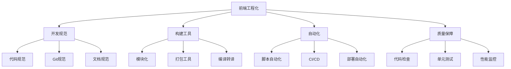

# 前端工程化完整指南

## 一、工程化基础

### 1.1 什么是前端工程化

**前端工程化**是使用软件工程的方法来解决前端开发中的效率、质量、协作等问题，通过工具、流程和规范提升团队生产力。

**核心目标：**
- 提高开发效率
- 保证代码质量
- 统一团队规范
- 优化项目性能
- 简化部署流程

### 1.2 工程化体系



## 二、项目初始化

### 2.1 项目脚手架

```bash
# React项目
npx create-react-app my-app
npm create vite@latest my-app -- --template react

# Vue项目
npm create vue@latest
npm create vite@latest my-app -- --template vue

# 自定义脚手架
npm init <template>
```

### 2.2 项目结构设计

```bash
my-project/
├── .github/              # GitHub配置
│   └── workflows/        # CI/CD workflows
├── .husky/               # Git hooks
├── .vscode/              # VS Code配置
├── public/               # 静态资源
├── src/
│   ├── assets/           # 资源文件
│   ├── components/       # 公共组件
│   ├── pages/            # 页面组件
│   ├── utils/            # 工具函数
│   ├── services/         # API服务
│   ├── stores/           # 状态管理
│   ├── styles/           # 样式文件
│   ├── types/            # TypeScript类型
│   ├── App.tsx
│   └── main.tsx
├── tests/                # 测试文件
├── .editorconfig         # 编辑器配置
├── .eslintrc.js          # ESLint配置
├── .prettierrc           # Prettier配置
├── .gitignore
├── package.json
├── tsconfig.json
└── vite.config.ts
```

## 三、代码规范

### 3.1 EditorConfig

```ini
# .editorconfig
root = true

[*]
charset = utf-8
indent_style = space
indent_size = 2
end_of_line = lf
insert_final_newline = true
trim_trailing_whitespace = true

[*.md]
trim_trailing_whitespace = false
```

### 3.2 ESLint配置

```javascript
// .eslintrc.js
module.exports = {
  env: {
    browser: true,
    es2021: true,
    node: true
  },
  extends: [
    'eslint:recommended',
    'plugin:react/recommended',
    'plugin:@typescript-eslint/recommended',
    'prettier'
  ],
  parser: '@typescript-eslint/parser',
  parserOptions: {
    ecmaFeatures: {
      jsx: true
    },
    ecmaVersion: 'latest',
    sourceType: 'module'
  },
  plugins: ['react', '@typescript-eslint'],
  rules: {
    'no-console': 'warn',
    'no-unused-vars': 'error',
    '@typescript-eslint/no-explicit-any': 'warn'
  }
};
```

### 3.3 Prettier配置

```json
{
  "semi": true,
  "singleQuote": true,
  "tabWidth": 2,
  "trailingComma": "es5",
  "printWidth": 100,
  "arrowParens": "always",
  "endOfLine": "lf"
}
```

## 四、Git工作流

### 4.1 分支策略

```bash
# Git Flow
main          # 生产环境
├── develop   # 开发环境
    ├── feature/user-login    # 功能分支
    ├── feature/payment
    ├── hotfix/bug-fix        # 紧急修复
    └── release/v1.0.0        # 发布分支
```

### 4.2 Commit规范

```bash
# Conventional Commits规范
<type>(<scope>): <subject>

# 示例
feat(auth): 添加用户登录功能
fix(payment): 修复支付金额计算错误
docs(readme): 更新README文档
style(button): 调整按钮样式
refactor(api): 重构API调用逻辑
test(user): 添加用户模块单元测试
chore(deps): 更新依赖版本
```

### 4.3 Commitlint配置

```javascript
// commitlint.config.js
module.exports = {
  extends: ['@commitlint/config-conventional'],
  rules: {
    'type-enum': [
      2,
      'always',
      ['feat', 'fix', 'docs', 'style', 'refactor', 'test', 'chore']
    ],
    'subject-max-length': [2, 'always', 72]
  }
};
```

### 4.4 Husky配置

```bash
# 安装Husky
npx husky-init && npm install

# 配置pre-commit
# .husky/pre-commit
#!/bin/sh
. "$(dirname "$0")/_/husky.sh"

npm run lint
npm run test
```

```json
{
  "scripts": {
    "prepare": "husky install",
    "lint": "eslint src --ext .ts,.tsx,.js,.jsx",
    "test": "jest"
  },
  "lint-staged": {
    "src/**/*.{js,jsx,ts,tsx}": [
      "eslint --fix",
      "prettier --write"
    ]
  }
}
```

## 五、构建优化

### 5.1 Vite配置

```typescript
// vite.config.ts
import { defineConfig } from 'vite';
import react from '@vitejs/plugin-react';
import path from 'path';

export default defineConfig({
  plugins: [react()],
  resolve: {
    alias: {
      '@': path.resolve(__dirname, 'src')
    }
  },
  build: {
    outDir: 'dist',
    sourcemap: false,
    minify: 'terser',
    terserOptions: {
      compress: {
        drop_console: true,
        drop_debugger: true
      }
    },
    rollupOptions: {
      output: {
        manualChunks: {
          vendor: ['react', 'react-dom'],
          router: ['react-router-dom']
        }
      }
    }
  }
});
```

### 5.2 环境变量管理

```bash
# .env.development
VITE_APP_TITLE=开发环境
VITE_API_BASE_URL=http://localhost:3000
VITE_APP_ENV=development

# .env.production
VITE_APP_TITLE=生产环境
VITE_API_BASE_URL=https://api.example.com
VITE_APP_ENV=production
```

```typescript
// 使用环境变量
const apiUrl = import.meta.env.VITE_API_BASE_URL;
```

## 六、自动化测试

### 6.1 单元测试

```typescript
// sum.test.ts
import { sum } from './sum';

describe('sum function', () => {
  test('adds 1 + 2 to equal 3', () => {
    expect(sum(1, 2)).toBe(3);
  });

  test('adds negative numbers', () => {
    expect(sum(-1, -2)).toBe(-3);
  });
});
```

### 6.2 组件测试

```typescript
// Button.test.tsx
import { render, screen, fireEvent } from '@testing-library/react';
import Button from './Button';

describe('Button Component', () => {
  test('renders button with text', () => {
    render(<Button>Click me</Button>);
    expect(screen.getByText('Click me')).toBeInTheDocument();
  });

  test('calls onClick when clicked', () => {
    const handleClick = jest.fn();
    render(<Button onClick={handleClick}>Click me</Button>);
    
    fireEvent.click(screen.getByText('Click me'));
    expect(handleClick).toHaveBeenCalledTimes(1);
  });
});
```

### 6.3 E2E测试

```typescript
// e2e/login.spec.ts
import { test, expect } from '@playwright/test';

test('user can login', async ({ page }) => {
  await page.goto('http://localhost:3000/login');
  
  await page.fill('input[name="username"]', 'testuser');
  await page.fill('input[name="password"]', 'password123');
  await page.click('button[type="submit"]');
  
  await expect(page).toHaveURL('http://localhost:3000/dashboard');
  await expect(page.locator('.welcome-message')).toContainText('Welcome');
});
```

## 七、CI/CD实践

### 7.1 GitHub Actions

```yaml
# .github/workflows/ci.yml
name: CI

on:
  push:
    branches: [ main, develop ]
  pull_request:
    branches: [ main, develop ]

jobs:
  build:
    runs-on: ubuntu-latest
    
    steps:
    - uses: actions/checkout@v3
    
    - name: Setup Node.js
      uses: actions/setup-node@v3
      with:
        node-version: '18'
        cache: 'npm'
    
    - name: Install dependencies
      run: npm ci
    
    - name: Run linter
      run: npm run lint
    
    - name: Run tests
      run: npm run test
    
    - name: Build project
      run: npm run build
    
    - name: Upload artifacts
      uses: actions/upload-artifact@v3
      with:
        name: dist
        path: dist/
```

### 7.2 自动部署

```yaml
# .github/workflows/deploy.yml
name: Deploy

on:
  push:
    branches: [ main ]

jobs:
  deploy:
    runs-on: ubuntu-latest
    
    steps:
    - uses: actions/checkout@v3
    
    - name: Setup Node.js
      uses: actions/setup-node@v3
      with:
        node-version: '18'
    
    - name: Install and Build
      run: |
        npm ci
        npm run build
    
    - name: Deploy to Server
      uses: easingthemes/ssh-deploy@v2.1.5
      env:
        SSH_PRIVATE_KEY: ${{ secrets.SERVER_SSH_KEY }}
        REMOTE_HOST: ${{ secrets.REMOTE_HOST }}
        REMOTE_USER: ${{ secrets.REMOTE_USER }}
        TARGET: /var/www/html
```

## 八、性能监控

### 8.1 Bundle分析

```bash
# 安装分析工具
npm install --save-dev rollup-plugin-visualizer

# vite.config.ts
import { visualizer } from 'rollup-plugin-visualizer';

export default defineConfig({
  plugins: [
    visualizer({
      open: true,
      gzipSize: true
    })
  ]
});
```

### 8.2 性能监控

```typescript
// performance.ts
export function reportWebVitals() {
  if ('web-vital' in window) {
    const { getCLS, getFID, getFCP, getLCP, getTTFB } = require('web-vitals');
    
    getCLS(console.log);
    getFID(console.log);
    getFCP(console.log);
    getLCP(console.log);
    getTTFB(console.log);
  }
}
```

## 九、文档工程化

### 9.1 组件文档

```typescript
/**
 * Button组件
 * @param {string} type - 按钮类型: 'primary' | 'secondary' | 'danger'
 * @param {boolean} disabled - 是否禁用
 * @param {() => void} onClick - 点击事件处理函数
 * @example
 * <Button type="primary" onClick={handleClick}>
 *   点击我
 * </Button>
 */
export function Button({ type, disabled, onClick, children }: ButtonProps) {
  // ...
}
```

### 9.2 Storybook

```typescript
// Button.stories.tsx
import type { Meta, StoryObj } from '@storybook/react';
import { Button } from './Button';

const meta: Meta<typeof Button> = {
  title: 'Components/Button',
  component: Button,
  tags: ['autodocs']
};

export default meta;
type Story = StoryObj<typeof Button>;

export const Primary: Story = {
  args: {
    type: 'primary',
    children: 'Primary Button'
  }
};

export const Secondary: Story = {
  args: {
    type: 'secondary',
    children: 'Secondary Button'
  }
};
```

## 十、面试高频问题

### Q1: 前端工程化解决了哪些问题？

**答案：**
1. 代码规范统一（ESLint、Prettier）
2. 开发效率提升（自动化工具）
3. 代码质量保障（测试、CI/CD）
4. 团队协作优化（Git规范、文档）
5. 性能优化（构建优化、监控）

### Q2: CI/CD的完整流程是什么？

**答案：**
1. 代码提交触发CI
2. 安装依赖
3. 代码检查（Lint）
4. 运行测试
5. 构建项目
6. 部署到服务器
7. 通知相关人员

### Q3: 如何保证代码质量？

**答案：**
1. 代码规范（ESLint、Prettier）
2. Git Hooks（pre-commit检查）
3. 单元测试（Jest）
4. E2E测试（Playwright）
5. Code Review
6. CI/CD自动化检查

## 十一、总结

### 11.1 工程化核心要素

- **规范化**：统一的代码和流程规范
- **自动化**：减少人工操作，提高效率
- **标准化**：统一的工具和配置
- **流程化**：完善的开发到部署流程

### 11.2 学习路径

1. 掌握基本工具（ESLint、Prettier、Git）
2. 学习构建工具（Webpack、Vite）
3. 实践自动化测试
4. 配置CI/CD流程
5. 优化开发体验

---

**相关文章：**
- [Webpack完整指南](./webpack-complete-guide.md)
- [包管理器详解](./package-managers.md)
- [代码风格管理](./code-style-management.md)
